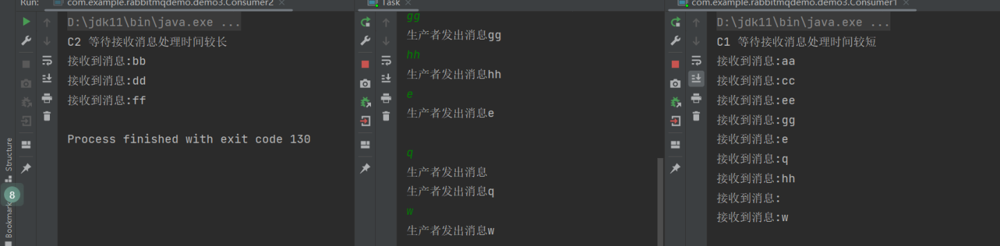
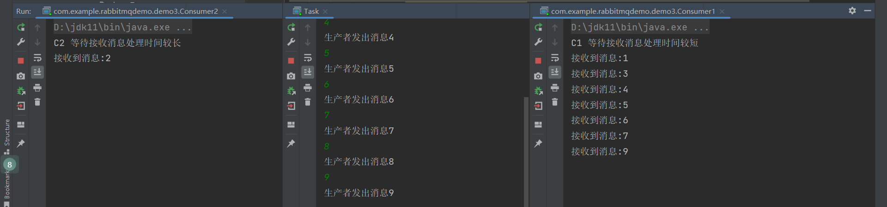
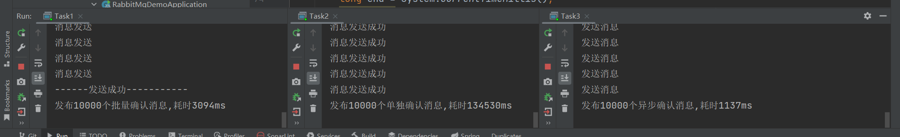
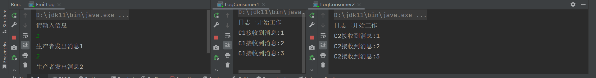
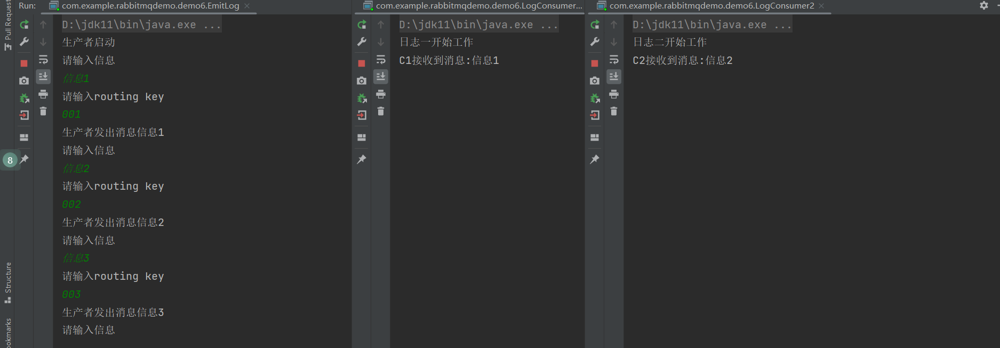
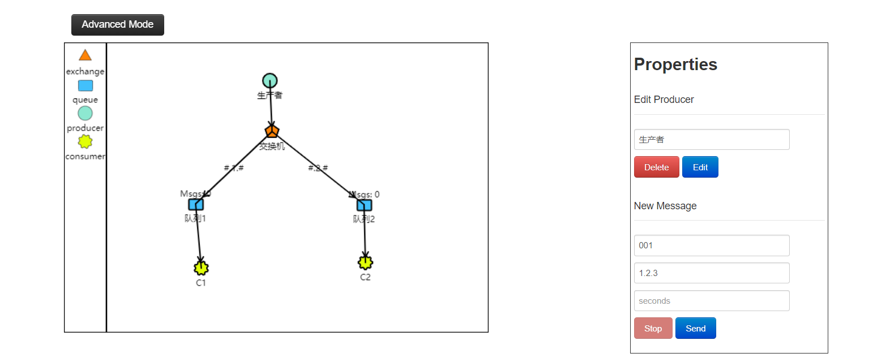
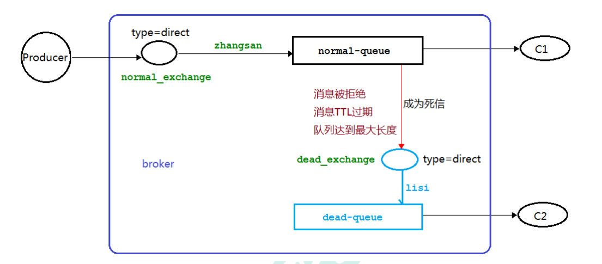

https://zhuanlan.zhihu.com/p/63700605

# DEMO

## docker 安装RabbitMQ

### 拉取镜像并启动容器

```bash
docker run -d --hostname my-rabbit --name rmq -p 15672:15672 -p 5672:5672 -p 25672:25672 -e RABBITMQ_DEFAULT_USER=huihe -e RABBITMQ_DEFAULT_PASS=123456 rabbitmq:3-management
```

### 开启防火墙

```bash
firewall-cmd --zone=public --add-port=15672/tcp --permanent
firewall-cmd --zone=public --add-port=25672/udp --permanent
firewall-cmd --zone=public --add-port=5672/tcp --permanent
systemctl restart firewalld.service
firewall-cmd --list-ports
```

### 进入docker容器内部

```
docker exec -it f2937 /bin/bash
```

查看已存在用户

```
rabbitmqctl list_users
```

创建账号

```
rabbitmqctl add_user admin 123 
```

设置用户角色

```
 rabbitmqctl set_user_tags admin administrator
```

设置用户权限

```
set_permissions [-p ]     rabbitmqctl set_permissions -p "/" admin ".*" ".*" ".*" 
```

用户 user_admin 具有/vhost1 这个 virtual host 中所有资源的配置、写、读权限 当前用户和角色


### 启动web界面

http://49.232.150.250:15672/#/
账号密码为之前设置的

## 创建java程序

### pom文件

```xml
<!--rabbitmq 依赖客户端-->
<dependency>
    <groupId>com.rabbitmq</groupId>
    <artifactId>amqp-client</artifactId>
    <version>5.8.0</version>
</dependency>
<!--操作文件流的一个依赖-->
<dependency>
    <groupId>commons-io</groupId>
    <artifactId>commons-io</artifactId>
    <version>2.6</version>
</dependency>
```

### 创建生产者

```java
package com.example.rabbitmqdemo.producers;

import com.rabbitmq.client.Channel;
import com.rabbitmq.client.Connection;
import com.rabbitmq.client.ConnectionFactory;

/**
 * producer1
 *
 * @author WTDYang
 * @date 2022/10/29
 */
public class Producer1 {
    private final static String QUEUE_NAME = "hello";
    public static void main(String[] args) throws Exception {
        //创建一个连接工厂
        ConnectionFactory factory = new ConnectionFactory();
        factory.setHost("49.232.150.250");
        factory.setUsername("huihe");
        factory.setPassword("123456");
        //channel 实现了自动 close 接口 自动关闭 不需要显示关闭
        try(Connection connection = factory.newConnection();
            Channel channel = connection.createChannel()) {
        /**
         * 生成一个队列
         * 1.队列名称
         * 2.队列里面的消息是否持久化 默认消息存储在内存中
         * 3.该队列是否只供一个消费者进行消费 是否进行共享 true 可以多个消费者消费
         * 4.是否自动删除 最后一个消费者端开连接以后 该队列是否自动删除 true 自动删除
         * 5.其他参数
         */
        channel.queueDeclare(QUEUE_NAME,false,false,false,null);
        String message="hello world111";
        /**
         * 发送一个消息
         * 1.发送到那个交换机
         * 2.路由的 key 是哪个
         * 3.其他的参数信息
         * 4.发送消息的消息体
         */
        channel.basicPublish("",QUEUE_NAME,null,message.getBytes());
        System.out.println("消息发送完毕");
        }
    }

}
```

### 创建消费者

```java
package com.example.rabbitmqdemo.consumers;

import com.rabbitmq.client.*;

/**
 * consumer1
 *
 * @author WTDYang
 * @date 2022/10/29
 */
public class Consumer1 {
    private final static String QUEUE_NAME = "hello";

    public static void main(String[] args) throws Exception {
        ConnectionFactory factory = new ConnectionFactory();
        factory.setHost("49.232.150.250");
        factory.setUsername("huihe");
        factory.setPassword("123456");
        Connection connection = factory.newConnection();
        Channel channel = connection.createChannel();
        System.out.println("等待接收消息.........");
        //推送的消息如何进行消费的接口回调
        DeliverCallback deliverCallback = (consumerTag, delivery) -> {
            String message = new String(delivery.getBody());
            System.out.println(message);
        };
        //取消消费的一个回调接口 如在消费的时候队列被删除掉了
        CancelCallback cancelCallback = (consumerTag) -> {
            System.out.println("消息消费被中断");
        };
        /**
         * 消费者消费消息
         * 1.消费哪个队列
         * 2.消费成功之后是否要自动应答 true 代表自动应答 false 手动应答
         * 3.消费者未成功消费的回调
         */
        channel.basicConsume(QUEUE_NAME, true, deliverCallback, cancelCallback);
    }
}
```

# Work Queues

轮询分发消息


首先提取工具类

```java
package com.example.rabbitmqdemo.utils;

import com.rabbitmq.client.Channel;
import com.rabbitmq.client.Connection;
import com.rabbitmq.client.ConnectionFactory;

/**
 * Rabbitmqutil
 *
 * @author WTDYang
 * @date 2022/10/29
 */
public class RabbitMQUtil {
    //得到一个连接的 channel
    public static Channel getChannel() throws Exception{
    //创建一个连接工厂
        ConnectionFactory factory = new ConnectionFactory();
        factory.setHost("49.232.150.250");
        factory.setUsername("huihe");
        factory.setPassword("123456");
        Connection connection = factory.newConnection();
        Channel channel = connection.createChannel();
        return channel;
    }
}
```

创建生产者

```java
package com.example.rabbitmqdemo.DemoTwo;

import com.example.rabbitmqdemo.utils.RabbitMQUtil;
import com.rabbitmq.client.Channel;

import java.util.Scanner;

public class Task01 {
    private static final String QUEUE_NAME = "hello";

    public static void main(String[] args) throws Exception {
        try (Channel channel = RabbitMQUtil.getChannel();) {
            channel.queueDeclare(QUEUE_NAME, false, false, false, null);
            //从控制台当中接受信息
            Scanner scanner = new Scanner(System.in);
            while (scanner.hasNext()) {
                String message = scanner.next();
                channel.basicPublish("", QUEUE_NAME, null, message.getBytes());
                System.out.println("发送消息完成:" + message);
            }
        }
    }
}
```

消费者

```java
package com.example.rabbitmqdemo.DemoTwo;

import com.example.rabbitmqdemo.utils.RabbitMQUtil;
import com.rabbitmq.client.Channel;


/**
 * consumer1
 *
 * @author WTDYang
 * @date 2022/10/29
 */
public class Consumer1 {
    public static final String QUEUE_NAME = "hello";

    public static void main(String[] args) throws Exception {
        Channel channel = RabbitMQUtil.getChannel();

        //接收消息
        System.out.println("C1 消费者启动等待消费.................. ");
        channel.basicConsume(QUEUE_NAME,true,
        (consumerTag,delivery)->{
            String receivedMessage = new String(delivery.getBody());
            System.out.println("C1接收到消息:"+receivedMessage);
        },
        (consumerTag)->{
            System.out.println(consumerTag+"消费者取消消费接口回调逻辑");
        }
        );
    }
}

```


```java
package com.example.rabbitmqdemo.DemoTwo;

import com.example.rabbitmqdemo.utils.RabbitMQUtil;
import com.rabbitmq.client.Channel;


/**
 * consumer1
 *
 * @author WTDYang
 * @date 2022/10/29
 */
public class Consumer2 {
    public static final String QUEUE_NAME = "hello";

    public static void main(String[] args) throws Exception {
        Channel channel = RabbitMQUtil.getChannel();

        //接收消息
        System.out.println("C2 消费者启动等待消费.................. ");
        channel.basicConsume(QUEUE_NAME,true,
                (consumerTag,delivery)->{
                    String receivedMessage = new String(delivery.getBody());
                    System.out.println("C2接收到消息:"+receivedMessage);
                },
                (consumerTag)->{
                    System.out.println(consumerTag+"消费者取消消费接口回调逻辑");
                }
        );
    }
}
```

启动效果

```
1
发送消息完成:1
2
发送消息完成:2
3
发送消息完成:3
4
发送消息完成:4
5
发送消息完成:5
6
发送消息完成:6
7
发送消息完成:7
```

```
C1 消费者启动等待消费.................. 
C1接收到消息:1
C1接收到消息:3
C1接收到消息:5
C1接收到消息:7
```

```
C2 消费者启动等待消费.................. 
C2接收到消息:2
C2接收到消息:4
C2接收到消息:6
C2接收到消息:12

```

## 消息手动应答

设置消息手动应答。

当一个处理机宕机的时候，路由接收不到应答，会奖消息重新转发给其他处理机。

就不会造成消息的丢失了。

生产者

```java
package com.example.rabbitmqdemo.demo3;

import com.example.rabbitmqdemo.utils.RabbitMQUtil;
import com.rabbitmq.client.Channel;

import java.util.Scanner;

/**
 * 任务
 *
 * @author WTDYang
 * @date 2022/10/29
 */
public class Task {
    private static final String TASK_QUEUE_NAME = "ack_queue";
    public static void main(String[] argv) throws Exception {
        try (Channel channel = RabbitMQUtil.getChannel())
        { channel.queueDeclare(TASK_QUEUE_NAME, false, false, false,null);
            Scanner sc = new Scanner(System.in);
            System.out.println("请输入信息");
            while (sc.hasNext()) {
                String message = sc.nextLine();channel.basicPublish("", TASK_QUEUE_NAME, null, message.getBytes("UTF-8"));
                System.out.println("生产者发出消息" + message);
            }
        }
    }
}
```

消费者（快）

```java
package com.example.rabbitmqdemo.demo3;

import com.example.rabbitmqdemo.utils.RabbitMQUtil;
import com.rabbitmq.client.Channel;
import com.rabbitmq.client.DeliverCallback;

public class Consumer1 {
    private static final String ACK_QUEUE_NAME="ack_queue";
    public static void main(String[] args) throws Exception
    {
        Channel channel = RabbitMQUtil.getChannel();
        System.out.println("C1 等待接收消息处理时间较短");
        //消息消费的时候如何处理消息
        DeliverCallback deliverCallback=(consumerTag,delivery)->{String message= new String(delivery.getBody());
            try {
                Thread.sleep(1000);
            } catch (InterruptedException e) {
                throw new RuntimeException(e);
            }
            System.out.println("接收到消息:"+message);
    /**
     * 1.消息标记 tag
     * 2.是否批量应答未应答消息
     */
        channel.basicAck(delivery.getEnvelope().getDeliveryTag(),false);
    };
        //采用手动应答
        boolean autoAck=false;
        channel.basicConsume(ACK_QUEUE_NAME,autoAck,deliverCallback,(consumerTag)->{
            System.out.println(consumerTag+"消费者取消消费接口回调逻辑");
        });
    }
}
```

生产者（慢）

```java
package com.example.rabbitmqdemo.demo3;
import com.example.rabbitmqdemo.utils.RabbitMQUtil;
import com.rabbitmq.client.Channel;
import com.rabbitmq.client.DeliverCallback;
public class Consumer2 {
    private static final String ACK_QUEUE_NAME="ack_queue";
    public static void main(String[] args) throws Exception
    {Channel channel = RabbitMQUtil.getChannel();
        System.out.println("C2 等待接收消息处理时间较长");
        //消息消费的时候如何处理消息
        DeliverCallback deliverCallback=(consumerTag,delivery)->{String message= new String(delivery.getBody());
            try {
                Thread.sleep(10000);
            } catch (InterruptedException e) {
                throw new RuntimeException(e);
            }
        System.out.println("接收到消息:"+message);
    /**
     * 1.消息标记 tag
     * 2.是否批量应答未应答消息
     */
        channel.basicAck(delivery.getEnvelope().getDeliveryTag(),false);
    };
        //采用手动应答
        boolean autoAck=false;
        channel.basicConsume(ACK_QUEUE_NAME,autoAck,deliverCallback,(consumerTag)->{
            System.out.println(consumerTag+"消费者取消消费接口回调逻辑");
        });
    }
}
```

当进行一段时间后将C2的进程杀死，发现原本分发给C2的消息转发给了C1



## 不公平分分发

​	意思就是如果这个任务我还没有处理完或者我还没有应答你，你先别分配给我，我目前只能处理一个

任务，然后 rabbitmq 就会把该任务分配给没有那么忙的那个空闲消费者，当然如果所有的消费者都没有完

成手上任务，队列还在不停的添加新任务，队列有可能就会遇到队列被撑满的情况，这个时候就只能添加

新的 worker 或者改变其他存储任务的策略。

**我们可以设置参数 channel.basicQos(1);**

```java
	channel.basicQos(1);
```



## 确认发布

单步

```java
package com.example.rabbitmqdemo.demo4_ack;

import com.example.rabbitmqdemo.utils.RabbitMQUtil;
import com.rabbitmq.client.Channel;

import java.util.Scanner;
import java.util.UUID;

/**
 * 任务
 *
 * @author WTDYang
 * @date 2022/10/29
 */
public class Task2 {
    public static final int MESSAGE_COUNT = 10000;
    public static void main(String[] argv) throws Exception {
        try (Channel channel = RabbitMQUtil.getChannel())
        {
            String queueName = UUID.randomUUID().toString();
            channel.queueDeclare(queueName, false, false, false, null);
            //开启发布确认
            channel.confirmSelect();
            long begin = System.currentTimeMillis();
            for (int i = 0; i < MESSAGE_COUNT; i++)
            {String message = i + "";
                channel.basicPublish("", queueName, null, message.getBytes());
            //服务端返回 false 或超时时间内未返回，生产者可以消息重发
                boolean flag = channel.waitForConfirms();
                if(flag){
                    System.out.println("消息发送成功");
                }
            }
            long end = System.currentTimeMillis();
            System.out.println("发布" + MESSAGE_COUNT + "个单独确认消息,耗时" + (end - begin) +"ms");
        }
}}
```

多步

```java
package com.example.rabbitmqdemo.demo4_ack;

import com.example.rabbitmqdemo.utils.RabbitMQUtil;
import com.rabbitmq.client.Channel;

import java.util.Scanner;
import java.util.UUID;

/**
 * 任务
 *
 * @author WTDYang
 * @date 2022/10/29
 */
public class Task1 {
    public static final int MESSAGE_COUNT = 10000;
    public static void main(String[] argv) throws Exception {
        try (Channel channel = RabbitMQUtil.getChannel())
        {String queueName = UUID.randomUUID().toString();
            channel.queueDeclare(queueName, false, false, false, null);
        //开启发布确认
            channel.confirmSelect();
        //批量确认消息大小
            int batchSize = 100;
        //未确认消息个数
            int outstandingMessageCount = 0;
            long begin = System.currentTimeMillis();
            for (int i = 0; i < MESSAGE_COUNT; i++)
            {String message = i + "";
                channel.basicPublish("", queueName, null, message.getBytes());
                System.out.println("消息发送");
                outstandingMessageCount++;
                if (outstandingMessageCount == batchSize)
                {channel.waitForConfirms();
                    System.out.println("------发送成功-----------");
                    outstandingMessageCount = 0;
                }
            }
        //为了确保还有剩余没有确认消息 再次确认
            if (outstandingMessageCount > 0)
            {channel.waitForConfirms();
            }
            long end = System.currentTimeMillis();
            System.out.println("发布" + MESSAGE_COUNT + "个批量确认消息,耗时" + (end - begin) +"ms");
        }
    }
}
```

异步

```java
package com.example.rabbitmqdemo.demo4_ack;

import com.example.rabbitmqdemo.utils.RabbitMQUtil;
import com.rabbitmq.client.Channel;
import com.rabbitmq.client.ConfirmCallback;

import java.util.UUID;
import java.util.concurrent.ConcurrentNavigableMap;
import java.util.concurrent.ConcurrentSkipListMap;

/**
 * 任务
 *
 * @author WTDYang
 * @date 2022/10/29
 */
public class Task3 {
    public static final int MESSAGE_COUNT = 10000;
    public static void main(String[] argv) throws Exception {
        try (Channel channel = RabbitMQUtil.getChannel())
        {String queueName = UUID.randomUUID().toString();
            channel.queueDeclare(queueName, false, false, false, null);
            //开启发布确认
            channel.confirmSelect();
            /**
             * 线程安全有序的一个哈希表，适用于高并发的情况
             * 1.轻松的将序号与消息进行关联
             * 2.轻松批量删除条目 只要给到序列号
             * 3.支持并发访问
             */
            ConcurrentSkipListMap<Long, String> outstandingConfirms = new
                    ConcurrentSkipListMap<>();
            /**
             * 确认收到消息的一个回调
             * 1.消息序列号
             * 2.true 可以确认小于等于当前序列号的消息
             * false 确认当前序列号消息
             */
            ConfirmCallback ackCallback = (sequenceNumber, multiple) -> {
                if (multiple) {
            //返回的是小于等于当前序列号的未确认消息 是一个 map
                    ConcurrentNavigableMap<Long, String> confirmed =
                            outstandingConfirms.headMap(sequenceNumber, true);
            //清除该部分未确认消息
                    confirmed.clear();
                }else{
            //只清除当前序列号的消息
                    outstandingConfirms.remove(sequenceNumber);
                }
            };
            ConfirmCallback nackCallback = (sequenceNumber, multiple) ->
            {String message = outstandingConfirms.get(sequenceNumber);
                System.out.println("发布的消息"+message+"未被确认，序列号"+sequenceNumber);
            };
            /**
             *  * 添加一个异步确认的监听器
             *  * 1.确认收到消息的回调
             *  * 2.未收到消息的回调
             */
            channel.addConfirmListener(ackCallback, null);
            long begin = System.currentTimeMillis();
            for (int i = 0; i < MESSAGE_COUNT; i++)
            {String message = "消息" + i;
        /**
         * channel.getNextPublishSeqNo()获取下一个消息的序列号
         * 通过序列号与消息体进行一个关联
         * 全部都是未确认的消息体
         */
                outstandingConfirms.put(channel.getNextPublishSeqNo(), message);
                channel.basicPublish("", queueName, null, message.getBytes());
            }

        long end = System.currentTimeMillis();
        System.out.println("发布" + MESSAGE_COUNT + "个异步确认消息,耗时" + (end - begin) +"ms");
     }
    }
}
```



发送速度不言而喻

# 交换机

## fanout

路由器广播给每一个绑定的队列

生产者

```java
package com.example.rabbitmqdemo.demo5;

import com.example.rabbitmqdemo.utils.RabbitMQUtil;
import com.rabbitmq.client.Channel;

import java.util.Scanner;

public class EmitLog {
    private static String EXCHANGE_NAME = "loggers";
    public static void main(String[] args) throws Exception {
        try (Channel channel = RabbitMQUtil.getChannel()) {
        /**
         * 声明一个 exchange
         * 1.exchange 的名称
         * 2.exchange 的类型
         */
         //   channel.exchangeDeclare(EXCHANGE_NAME, "fanout");
            Scanner sc = new Scanner(System.in);
            System.out.println("请输入信息");
            while (sc.hasNext()) {
                String message = sc.nextLine();
                channel.basicPublish(EXCHANGE_NAME, "", null, message.getBytes("UTF-8"));
                System.out.println("生产者发出消息" + message);
            }
        }
    }
}
```

消费者1

```java
package com.example.rabbitmqdemo.demo5;

import com.example.rabbitmqdemo.utils.RabbitMQUtil;
import com.rabbitmq.client.Channel;

public class LogConsumer1 {
    private static String EXCHANGE_NAME = "loggers";
    public static void main(String[] args) throws Exception {
        Channel channel = RabbitMQUtil.getChannel();
        //channel.exchangeDeclare(EXCHANGE_NAME,"fanout");

        String queue = channel.queueDeclare().getQueue();
        channel.queueBind(queue,EXCHANGE_NAME,"");
        System.out.println("日志一开始工作");
        channel.basicConsume(queue,true,
                (consumerTag,delivery)->{
                    String receivedMessage = new String(delivery.getBody());
                    System.out.println("C1接收到消息:"+receivedMessage);
                },
                (consumerTag)->{
                    System.out.println(consumerTag+"消费者取消消费接口回调逻辑");
                }
        );
    }
}
```

消费者2

```java
package com.example.rabbitmqdemo.demo5;

import com.example.rabbitmqdemo.utils.RabbitMQUtil;
import com.rabbitmq.client.Channel;

public class LogConsumer2 {
    private static String EXCHANGE_NAME = "loggers";
    public static void main(String[] args) throws Exception {
        Channel channel = RabbitMQUtil.getChannel();
      //  channel.exchangeDeclare(EXCHANGE_NAME,"fanout");

        String queue = channel.queueDeclare().getQueue();
        channel.queueBind(queue,EXCHANGE_NAME,"");
        System.out.println("日志二开始工作");
        channel.basicConsume(queue,true,
                (consumerTag,delivery)->{
                    String receivedMessage = new String(delivery.getBody());
                    System.out.println("C2接收到消息:"+receivedMessage);
                },
                (consumerTag)->{
                    System.out.println(consumerTag+"消费者取消消费接口回调逻辑");
                }
        );
    }
}
```



## 路由模式

生产者

```java
package com.example.rabbitmqdemo.demo6;

import com.example.rabbitmqdemo.utils.RabbitMQUtil;
import com.rabbitmq.client.Channel;

import java.util.Scanner;

public class EmitLog {
    private static String EXCHANGE_NAME = "logs";
    public static void main(String[] args) throws Exception {
        try (Channel channel = RabbitMQUtil.getChannel()) {
        /**
         * 声明一个 exchange
         * 1.exchange 的名称
         * 2.exchange 的类型
         */
            channel.exchangeDeclare(EXCHANGE_NAME, "direct");
            Scanner sc = new Scanner(System.in);
            System.out.println("生产者启动");
            while (true) {
                System.out.println("请输入信息");
                String message = sc.nextLine();
                System.out.println("请输入routing key");
                String key = sc.nextLine();
                channel.basicPublish(EXCHANGE_NAME, key, null, message.getBytes("UTF-8"));
                System.out.println("生产者发出消息" + message);
            }
        }
    }
}
```

消费者1

```java
package com.example.rabbitmqdemo.demo6;

import com.example.rabbitmqdemo.utils.RabbitMQUtil;
import com.rabbitmq.client.Channel;

public class LogConsumer1 {
    private static String EXCHANGE_NAME = "logs";
    public static void main(String[] args) throws Exception {
        Channel channel = RabbitMQUtil.getChannel();
        //channel.exchangeDeclare(EXCHANGE_NAME,"fanout");

        String queue = channel.queueDeclare().getQueue();
        channel.queueBind(queue,EXCHANGE_NAME,"001");
        System.out.println("日志一开始工作");
        channel.basicConsume(queue,true,
                (consumerTag,delivery)->{
                    String receivedMessage = new String(delivery.getBody());
                    System.out.println("C1接收到消息:"+receivedMessage);
                },
                (consumerTag)->{
                    System.out.println(consumerTag+"消费者取消消费接口回调逻辑");
                }
        );
    }
}
```

消费者2

```java
package com.example.rabbitmqdemo.demo6;

import com.example.rabbitmqdemo.utils.RabbitMQUtil;
import com.rabbitmq.client.Channel;

public class LogConsumer2 {
    private static String EXCHANGE_NAME = "logs";
    public static void main(String[] args) throws Exception {
        Channel channel = RabbitMQUtil.getChannel();
      //  channel.exchangeDeclare(EXCHANGE_NAME,"fanout");

        String queue = channel.queueDeclare().getQueue();
        channel.queueBind(queue,EXCHANGE_NAME,"002");
        System.out.println("日志二开始工作");
        channel.basicConsume(queue,true,
                (consumerTag,delivery)->{
                    String receivedMessage = new String(delivery.getBody());
                    System.out.println("C2接收到消息:"+receivedMessage);
                },
                (consumerTag)->{
                    System.out.println(consumerTag+"消费者取消消费接口回调逻辑");
                }
        );
    }
}
```




## 主题交换机



发送到类型是 topic 交换机的消息的 routing_key 不能随意写，必须满足一定的要求，它**必须是一个单词列表，以点号分隔开**。这些单词可以是任意单词，比如说："stock.usd.nyse", "nyse.vmw","quick.orange.rabbit".这种类型的。当然这个单词列表最多不能超过 255 个字节。

在这个规则列表中，其中有两个替换符是大家需要注意的

- *****(星号)可以代替一个单词
- **#**(井号)可以替代零个或多个单词

# 死信队列

先从概念解释上搞清楚这个定义，死信，顾名思义就是无法被消费的消息，字面意思可以这样理解，一般来说，producer 将消息投递到 broker 或者直接到queue 里了，consumer 从 queue 取出消息进行消费，但某些时候由于特定的**原因导致** **queue** **中的某些消息无法被消费**，这样的消息如果没有后续的处理，就变成了死信，有死信自然就有了死信队列。应用场景:为了保证订单业务的消息数据不丢失，需要使用到 RabbitMQ 的死信队列机制，当消息消费发生异常时，将消息投入死信队列中.还有比如说: 用户在商城下单成功并点击去支付后在指定时间未支付时自动失效

**死信的来源**

消息 TTL 过期

队列达到最大长度(队列满了，无法再添加数据到 mq 中)




